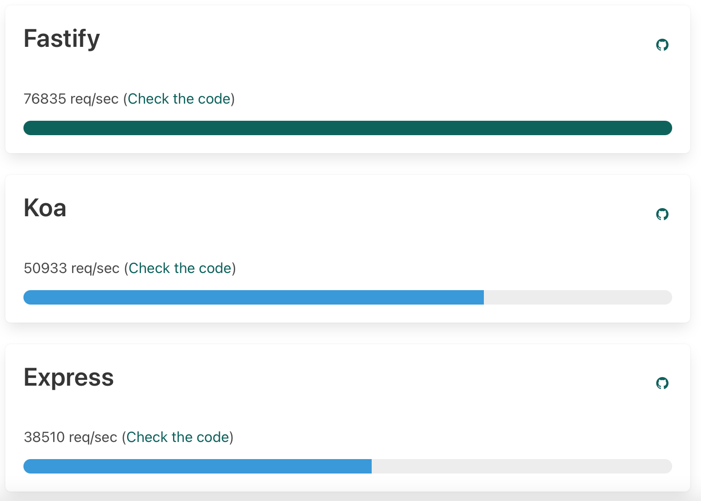
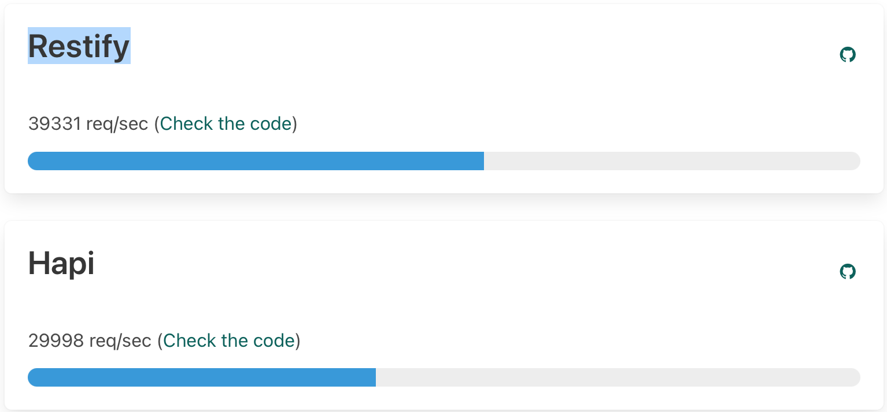
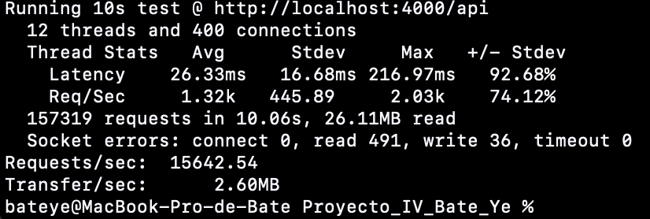
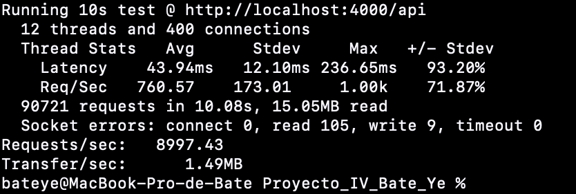
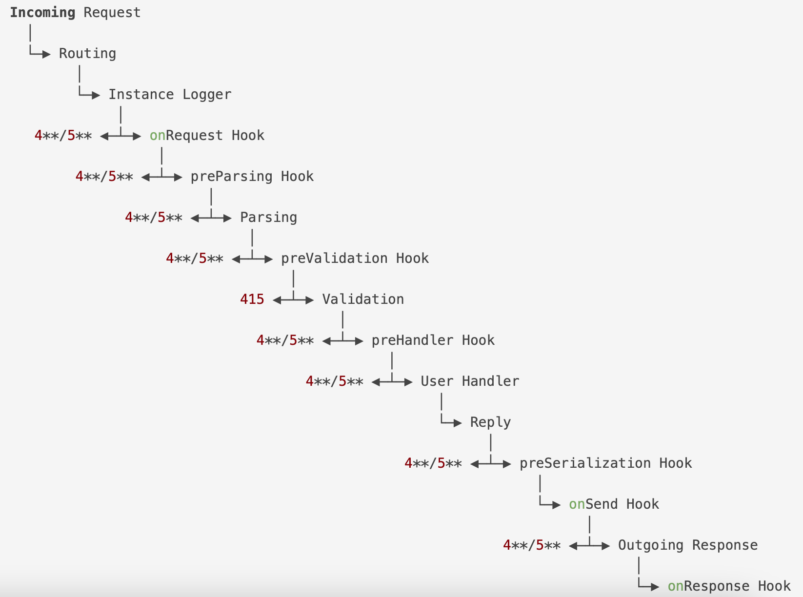

# Fastify

## Justificación:

He elegido Fastify como el Framework para mi microservicio, lo he elegido por varias razones:
  - La sintaxis es parecida a Express.
  - Es un Framework nuevo que presenta mejores prestaciones que otros como Express, Koa etc...
  - Tiene un ecosistema muy completo, y es soportado por OPENJS Foundation.
  - Tiene una comunidad muy creciente.
  - Y lo más importante, por los Benchmarks tanto como los que tienen en su documentación como los que he hecho personalmente.

### Benchmarks:
En la [documentación de Fastify](https://www.fastify.io/benchmarks/), tienen un apartado que me proporciona una serie de Benchmarks en comparación con otros Frameworks, y la verdad es que es asombromo lo rápido que es este Framework según dichos Benchmarks:





Según ellos, Fastify es mucho más rápido que Koa, Express, Restify y Hapi, pudiendo llegar ha hacer hasta 76835 peticiones por segundo mientras que los demás, no llegan ni a 51000 peticiones por segundo.

He realizado un pequeño benchmark en también para verificarlo, lo he hecho comparando Fastify con Express, y he obtenido estos resultados:

- Fastify:



- Express:



Fastify ha realizado un total de 15642.54 peticiones por segundo mientras que Express, sólamente unos 8997.43 peticiones por segundo, viendo esto, sé que Fastify es casi el doble de rápido que Express, por ese motivo, lo he escogido para mi proyecto.


## Uso en la práctica:

Para esta práctica, he usado Fastify para definir las rutas, para loggear informaciones y para usar los hooks (más adelante explico que son).

### Definir rutas:
Para definir las rutas, nos proporcionan Fastify una serie de métodos ya simplificados:

```bash
  fastify.get(path, [options], handler);
  fastify.head(path, [options], handler);
  fastify.post(path, [options], handler);
  fastify.put(path, [options], handler);
  fastify.delete(path, [options], handler);
  fastify.options(path, [options], handler);
  fastify.patch(path, [options], handler);
```

Cada uno de ellos corresponde a una petición tipo HTTP.

### Uso de logs:
En Fastify es posible usar también los logs, y es muy sencillo de usarlos.
Para indicar que voy a usar logs, al definir el objeto de tipo Fastify, le paso este parámetro:

```bash
  $ app = Fastify({logger:true});
```

Con esta opción indicas que se loggee todo, info, warnings, erres etc...

Puedo indicarle que sólamente loggee por ejemplo, informaciones con esto:
```bash
  $ app = Fastify({logger:{level:'info'}});
```

Incluso para cada ruta, puedo indicarle el nivel que quiero que se loggee de forma independiente:

```bash
  app.get('/ruta',{logLevel:'info'},handler);
```
Yo en mi microservicio, los logs los suelo hacer dentro de un hook, que a continuación voy a explicarlo.

### Uso de hooks:
Los hooks aquí, son como los middlewares, Fastify se enfoca más en el concepto de hooks que de middlewares.
En la práctica los he usado siguiendo estos pasos:
  - Primero he definido una función que lo usaré como un plugin, por ejemplo:

  ```
  function miHook(app,options,done){}
  ```
  a la función se le pasa el objeto, opciones y done es una función que se llama una vez terminada la función.
  - Dentro de la función defino los hooks que quiero y las rutas que quiero que usen dichos hooks:

  ```bash
    function miHook(app,options,done){
      app.addHook('preHandler',(req,res,next)=>{
        req.log.info('hook de ejemplo');
        next();
      });
      app.get('/ruta',handler);
      done();
    }
  ```

  - Una vez terminada lo registro con app.register():

  ```bash
    app.register(miHook);
  ```

En mi código uso los hooks sobre todo para hacer chequeo de algunos valores antes de que se active el handler de la ruta.
Fastify tiene un ciclo de vida de esta forma:



Y los hooks se "enganchan" a momentos entremedios del código y la petición.
